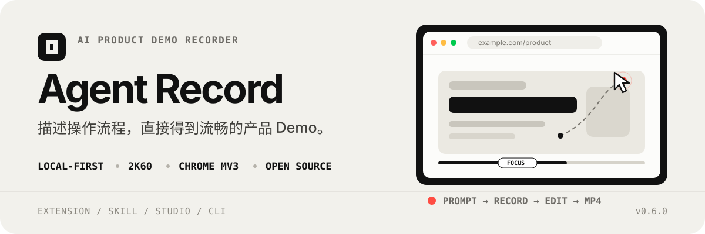
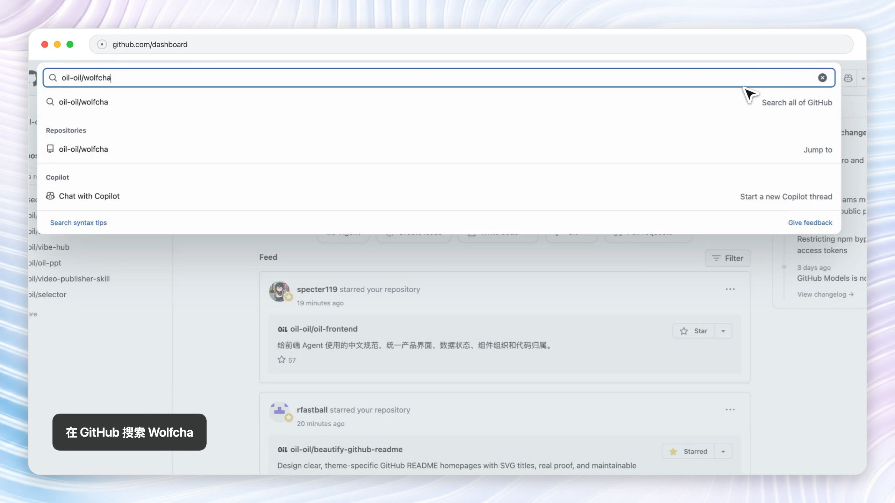
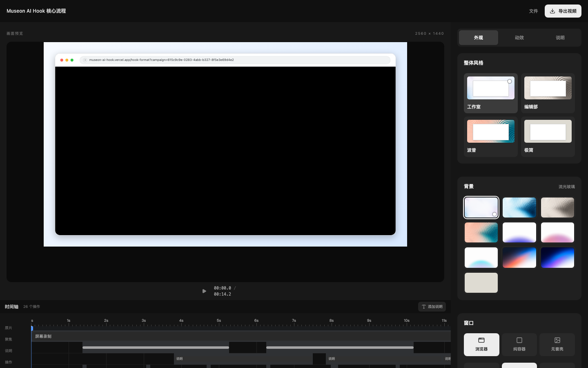
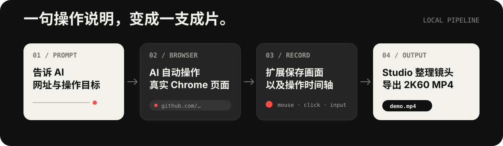

<p align="center">
  
</p>

<p align="center">
  <a href="#看效果">看效果</a> ·
  <a href="#工作方式">工作方式</a> ·
  <a href="#快速开始">快速开始</a> ·
  <a href="#本地开发">本地开发</a>
</p>

<p align="center">
  <code>macOS 13+</code>
  <code>Chrome 116+</code>
  <code>默认 2K60</code>
  <code>本地处理</code>
  <code>AGPL-3.0</code>
</p>

Agent Record 是面向 AI Agent 的网页录制与 Demo 制作工具。你只需要描述网址和操作目标，AI 就会完成浏览器操作、录制、剪辑和验收，最终交付带自然鼠标、点击聚焦、页面转场、浏览器套壳与说明文字的 MP4。

> **当前版本仅支持 macOS 13 Ventura 或更高版本，以及 Google Chrome 116 或更高版本。暂不支持 Windows、Linux、Firefox 和 Safari。**

## 系统要求

| 项目 | 要求 |
| --- | --- |
| 操作系统 | macOS 13 Ventura 或更高版本 |
| 浏览器 | Google Chrome 116 或更高版本 |
| 运行环境 | Node.js 22、npm 10 或更高版本 |
| 视频工具 | FFmpeg 与 ffprobe |
| 首次授权 | macOS 屏幕录制权限；手动加载一次 Chrome 扩展 |

Windows 和 Linux 目前没有录屏后端。其他 Chromium 浏览器可能可以运行，但不属于正式支持范围。

## 看效果

<p align="center">
  <a href="./website/public/assets/demo.mp4">
    
  </a>
</p>

> 点击画面查看真实成片：15 秒、2560×1440、60fps、H.264。它由本地录制服务、扩展事件、时间轴和离线渲染链路生成，不是概念动画。

<p align="center">
  
</p>

Studio 用来调整背景、套壳、镜头、光标、字幕与节奏。常用参数已经整理成预设，不需要先学习传统剪辑软件。

## 为什么用它

- **AI 原生流程**：操作说明本身就是录制脚本，产品更新后可以重新执行，而不是重新手工录屏。
- **真实操作，后期整理**：页面动画保持真实速度；等待、鼠标、镜头和转场在录制后统一处理。
- **本地优先**：画面、操作轨迹、项目文件和最终视频默认留在本机，没有账号、订阅或云端上传。
- **可继续编辑**：AI 可以直接交付成片，也可以把项目交给 Studio 继续微调。
- **高清输出**：默认 2K60，可按需输出 1080p 或 4K60；光标、镜头和字幕会完整烧录进视频。

## 工作方式

<p align="center">
  
</p>

1. **描述目标**：告诉 AI 网址、关键操作和想强调的内容。
2. **自动操作**：AI 使用 Chrome 自动化完成点击、输入、滚动和页面切换。
3. **同步录制**：本地 ScreenCaptureKit 服务保存 Chrome 窗口画面；扩展只记录鼠标、点击、输入、滚动和页面事件。
4. **整理成片**：Studio 与 CLI 读取会话产物，生成自然鼠标、聚焦镜头、说明文字和 MP4。

```text
“访问 GitHub Dashboard，搜索 oil-oil/wolfcha，
进入右侧链接，输入 ID 并开始游戏。录成一支简洁的 2K60 Demo。”
```

## 快速开始

### 1. 准备环境

- macOS `13+`
- Node.js `22.x`
- npm `10+`
- Google Chrome `116+`
- FFmpeg / ffprobe

克隆仓库并进入项目根目录：

```bash
npm ci
npm run check
```

### 2. 加载扩展事件桥

运行：

```bash
npm run extension:setup
```

命令会把扩展同步到固定的本地目录，打开 Chrome 扩展管理页，并在 Finder 中选中该目录。开启“开发者模式”，点击“加载已解压的扩展程序”即可。安装一次后可以长期使用；更新后重新运行命令，再在扩展管理页重新加载。

扩展只负责把普通 HTTP/HTTPS 页面的操作事件发送给本地服务；画面和视频文件由本地服务管理。Chrome 内部页面不能录制。

### 3. 安装 Skill

把 [`skills/glidetake/`](skills/glidetake/) 复制到 AI Agent 支持的本地 Skill 目录。以 Codex 为例：

```text
~/.codex/skills/glidetake/
```

重新打开 Agent 后，直接描述目标网站和操作流程。Skill 会先运行 `doctor`，再用 CLI 启动本地录制服务、自动操作 Chrome、用 CLI 停止录制，最后创建项目、渲染视频并验收输出。

从 GitHub 安装独立 `.skill` 后，首次使用会自动定位当前或祖先源码根；没有源码根时，会按 Skill 内版本清单从对应 GitHub Release 拉取完整桌面伴侣，校验 `SHA256SUMS` 后缓存到用户 Application Support。无需手动下载桌面包。Chrome 扩展首次加载和 macOS 屏幕录制授权仍需用户确认，程序不会操作 `chrome://extensions`。

### 4. 唯一录制流程

在项目根目录执行：

```bash
node skills/glidetake/scripts/agent-record-proxy.mjs doctor
node skills/glidetake/scripts/agent-record-proxy.mjs start --url "https://example.com" --app "Google Chrome"
# AI 使用 Chrome 自动化完成自然点击、滚动和输入
node skills/glidetake/scripts/agent-record-proxy.mjs status
node skills/glidetake/scripts/agent-record-proxy.mjs stop
```

`stop` 返回 JSON。先运行 `node skills/glidetake/scripts/agent-record-proxy.mjs process <video> <timeline> artifacts/processed.mp4` 剪掉等待并生成处理后时间轴，再把处理后产物交给 Studio；每个会话目录包含 `capture.mov`、`timeline.json` 和 `manifest.json`。ScreenCaptureKit 本地服务是唯一画面来源，默认 macOS 首版。

<details>
<summary><strong>需要手动创建与渲染项目时</strong></summary>

```bash
npm run studio:cli -- init \
  --video artifacts/capture.mov \
  --motion artifacts/timeline.json \
  --out artifacts/demo-project.json \
  --name "产品演示" \
  --background glass-sunrise \
  --shell browser \
  --zoom 1.20 \
  --resolution 2k

npm run studio:cli -- validate \
  --file artifacts/demo-project.json

npm run studio:render -- \
  --project artifacts/demo-project.json \
  --out artifacts/demo-final-2k60.mp4 \
  --quality final

skills/glidetake/scripts/verify_demo.sh \
  artifacts/demo-final-2k60.mp4 2560 1440 60
```

</details>

## 项目组成

| 模块 | 作用 |
| --- | --- |
| [`extension/`](extension/) | Chrome Manifest V3 扩展，只负责操作事件采集与本地桥接 |
| [`skills/glidetake/`](skills/glidetake/) | 指导 AI 完成自动操作、录制、配置、渲染与验收 |
| [`studio/`](studio/) | 本地视频预览和编辑器 |
| [`scripts/`](scripts/) | 项目 CLI、Remotion 渲染、录制合并和质量检查 |
| [`website/`](website/) | 可部署到 Vercel 的 Next.js 官网 |
| [`demo-site/`](demo-site/) | 用于回归录制流程的本地演示站 |

本地录制服务输出 `capture.mov`、`timeline.json` 和 `manifest.json`。Studio 与 CLI 使用同一项目格式，因此 AI 自动配置和人工微调不会形成两套数据。

## 发布包

运行：

```bash
npm run release:build
```

会在 `release/` 生成：

| 文件 | 用途 |
| --- | --- |
| `agent-record-extension-<version>.zip` | 可自行加载或提交 Chrome Web Store 的扩展包 |
| `agent-record-<version>.skill` | 独立 Skill 包 |
| `agent-record-studio-<version>.zip` | Studio 静态构建 |
| `agent-record-desktop-<version>.zip` | 扩展、Skill、Studio、CLI 完整本地包 |
| `SHA256SUMS` | 发布文件校验值 |

正式版本应把这些文件上传到 GitHub Releases，而不是提交到 Git 仓库。

## 本地开发

```bash
# 完整测试与静态检查
npm run ci

# Studio
npm run studio:dev

# Next.js 官网
npm run website:dev

# 本地演示站
npm run demo
```

- 官网：`http://127.0.0.1:3000/`
- 演示站：`http://127.0.0.1:4173/demo/`
- Studio：`http://127.0.0.1:4173/studio/`

CI 会检查单元测试、光标轨迹、镜头聚焦、TypeScript、Studio 构建、体积预算、文件完整性和脚本语法。

## 隐私与限制

- 当前正式支持 macOS 13+ 和 Google Chrome 116+；Windows、Linux、Firefox 和 Safari 暂不支持。
- 其他 Chromium 浏览器不在正式支持范围内。
- 扩展会读取用户主动录制页面的网址、标题和操作轨迹；画面由本地录制服务捕获，输入内容不会写入时间轴。
- 录制素材和项目默认保存在本机；项目没有账号系统、遥测或内置云端上传。
- 录制画面由 macOS ScreenCaptureKit 本地服务捕获；最终交付使用 CLI 离线渲染并完整解码验收。
- 扩展只申请网页事件采集和本地桥接所需权限；公开发布前仍需完成 Chrome Web Store 权限说明与隐私申报。

完整说明见 [隐私说明](PRIVACY.md) 和 [第三方与素材清单](THIRD_PARTY_NOTICES.md)。

## 许可证

代码采用 [GNU AGPL-3.0-only](LICENSE)。公开提供修改后的版本或网络服务时，需要按许可证提供对应源码。

Agent Record 名称、Logo、图标和品牌素材不包含在代码许可中，详见 [品牌说明](TRADEMARKS.md)。
